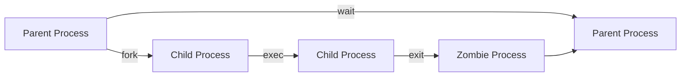

# Mini Project(PIC)!


## Contributers-
1. Shivam L1-2
2. Vipul Jain L1-18
3. Mudit Kumar Tyagi L1-22
4. Vaibhav Upreti L1-30


# Zombie Process

### About 
A zombie or a "defunct process" in Linux(or UNIX based kernel) is a process that has been completed, but its entry still remains in the process table due to lack of correspondence between the parent and child processes. Usually, a parent process keeps a check on the status of its child processes through the wait() function. When the child process has finished, the wait function signals the parent to completely exit the process from the memory. However, if the parent fails to call the wait function for any of its children, the child process remains alive in the system as a dead or zombie process. These zombie processes might accumulate, in large numbers, on your system and affect its performance.


### Flowchart 
A chart to illustrate Zombie process working


### Code & Guide to run 
Save this file as zombie.c in your folder
```c
```c
#include <stdlib.h>
#include <sys/types.h>
#include <unistd.h>

int main ()
{
  pid_t child_pid;

  child_pid = fork ();
  if (child_pid > 0) {
    sleep (60);
  }
  else {
    exit (0);
  }
  return 0;
}
```
The following process will run in your terminal for 60s even after closing this. You can check this by running the following commands-

Run the code in your terminal by entering these two commands or use coderunner VSC extension
```bash
gcc zombie.c
```
Now run the zombie program:
```c
./a.out
```
The ps command will now also show this defunct process, open a new terminal and use the below command to check the defunct process:
```c
ps -ef | grep a.out
  501  9366  6755   0  5:40pm ttys000    0:00.00 ./a.out
  501  9367  9366   0  5:40pm ttys000    0:00.00 (a.out)
  501  9397  8546   0  5:40pm ttys002    0:00.00 grep --color=auto --exclude-dir=.bzr --exclude-dir=CVS --exclude-dir=.git --exclude-dir=.hg --exclude-dir=.svn --exclude-dir=.idea --exclude-dir=.tox a.out
```


## Output Screenshot

SS1- 
Running the Zombie process

SS2- 
Logs


